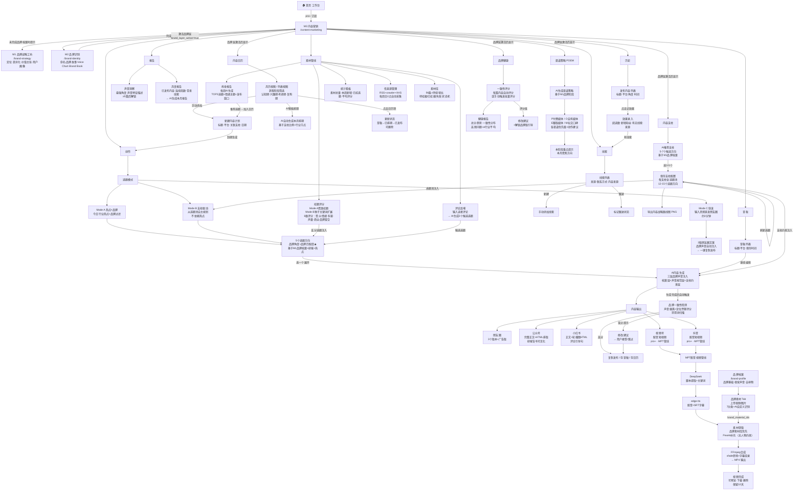

# M3 品牌发声 — 用户操作流程图

> 更新日期：2026-04-23
> 格式：Mermaid flowchart（粘入 draw.io / Notion / GitHub 可直接渲染）



---

## 渲染方式

| 工具 | 操作 |
|------|------|
| **draw.io** | 打开 → Extras → Edit Diagram → 粘贴上方代码块内容（选 Mermaid） |
| **Notion** | 代码块 → 语言选 `mermaid` → 粘贴 |
| **GitHub** | 直接在 `.md` 文件中的 ` ```mermaid ` 代码块里粘贴 |
| **Mermaid Live** | https://mermaid.live → 粘贴左侧 → 右侧实时预览 |

## 关键流向说明

- **品牌层激活**：M1+M2 完成后，内容支柱/日历/POEM/品牌健康 4个Tab才出现；支柱约束同时注入内容生成
- **循环闭环**：素材管线高分选题 → 创作选题；评论反哺 → 候选选题 → 创作
- **历史→线索**：效果录入时勾选"有线索"→ 自动流向线索Tab
- **草稿→创作**：草稿可继续编辑，重进生成环节
- **日历→创作**：日历项到期提醒用户去创作Tab生成对应内容
- **品牌素材**：品牌档案上传素材 → MPT视频管线优先使用
